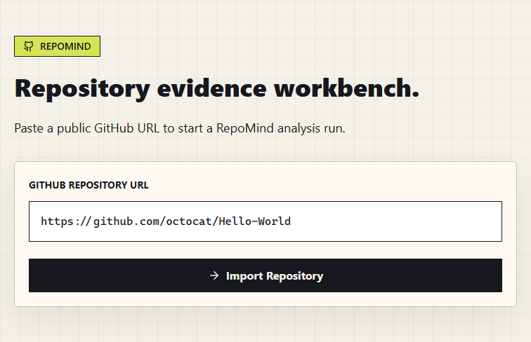
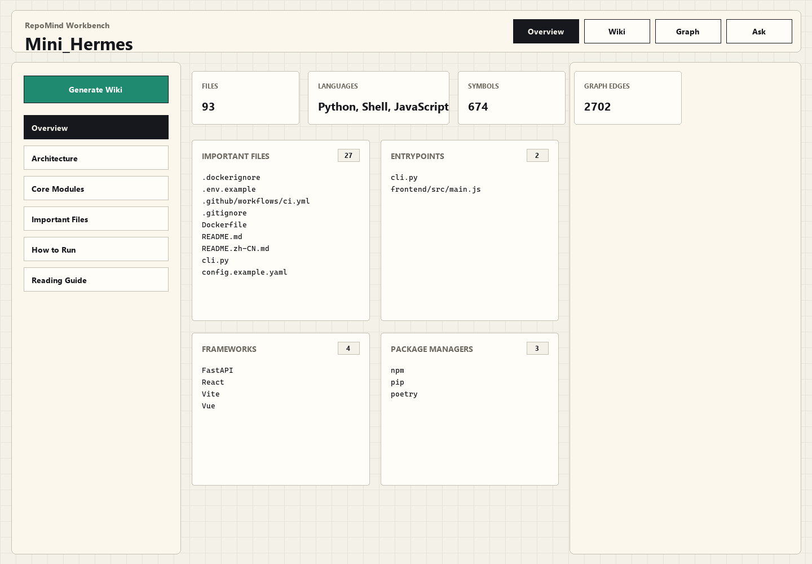
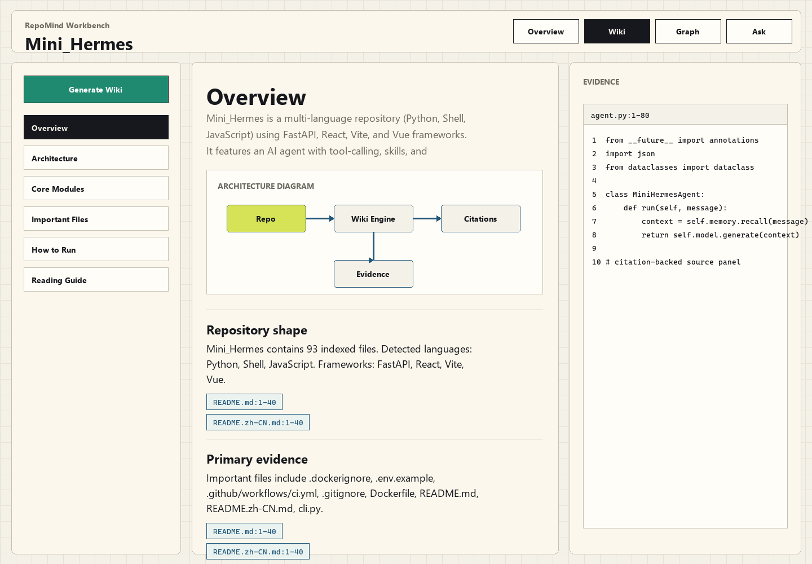
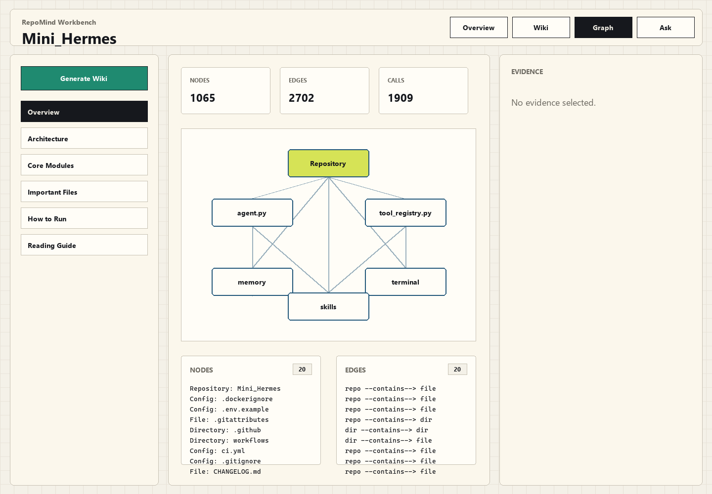
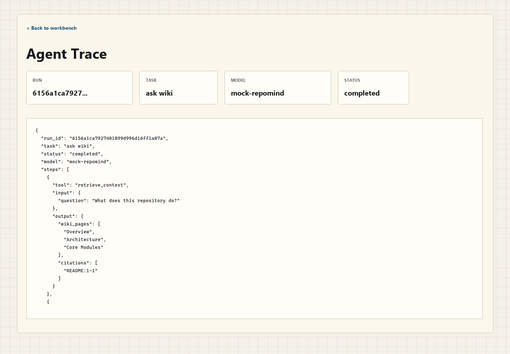
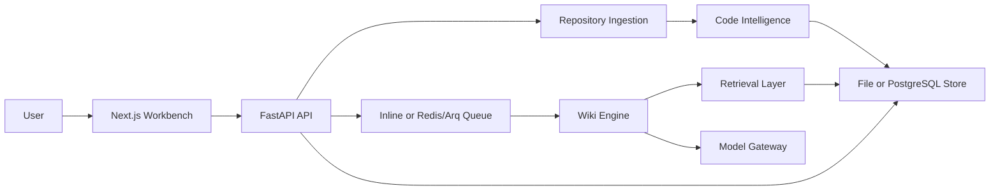

# RepoMind

<p align="center">
  <strong>Repository evidence workbench and citation-backed LLM wiki generator.</strong>
</p>

<p align="center">
  <a href="#quick-start"></a>
  <a href="#api"></a>
  <a href="#web-workbench"></a>
  <a href="#docker"></a>
  <a href="#model-providers"></a>
</p>

RepoMind turns a GitHub repository into a navigable evidence workspace. It clones a public repository, filters noisy files, builds a repository profile, extracts symbols, creates a lightweight RepoKG, generates structured wiki pages with citations, answers repository questions from grounded context, and records agent traces for inspection.

The project runs without external model credentials by default through `MockModelClient`. Real model providers are optional and can be enabled only when valid API keys are configured.

## Contents

- [Screenshots](#screenshots)
- [Features](#features)
- [Architecture](#architecture)
- [Quick Start](#quick-start)
- [Docker](#docker)
- [Configuration](#configuration)
- [API](#api)
- [Development](#development)
- [Project Layout](#project-layout)
- [Roadmap](#roadmap)
- [License](#license)

## Screenshots

### Repository Import

<p align="center">
  
</p>

### Web Workbench

<p align="center">
  
</p>

### Wiki, Graph, and Trace

<table>
  <tr>
    <td width="50%">
      
    </td>
    <td width="50%">
      
    </td>
  </tr>
  <tr>
    <td colspan="2">
      
    </td>
  </tr>
</table>

## Features

- Import public GitHub repositories from a repository URL.
- Ignore unsafe or noisy content such as `.git`, `node_modules`, virtual environments, build outputs, binary files, and oversized files.
- Detect languages, package managers, frameworks, README files, dependency files, config files, entrypoints, tests, important files, and important directories.
- Extract Python, JavaScript, and TypeScript symbols for classes, functions, methods, imports, and exports.
- Build a lightweight RepoKG with repository, directory, file, config, dependency, class, function, and method nodes.
- Generate structured wiki pages for Overview, Architecture, Core Modules, Important Files, How to Run, and Reading Guide.
- Validate source citations and expose source files in an evidence panel.
- Ask repository questions over wiki pages, symbols, graph evidence, and source snippets.
- Record agent runs and tool-call traces for generated wiki and ask workflows.
- Store metadata locally or in PostgreSQL through SQLAlchemy-backed storage.
- Run tasks inline for local development or through Redis/Arq for worker-based execution.
- Use in-memory retrieval by default, with Qdrant and SQL/pgvector-style adapters available by configuration.
- Provide a Next.js workbench with Wiki, React Flow graph, Ask, Evidence, Monaco, Mermaid, and shadcn-style UI components.

## Architecture



RepoMind keeps the local development path intentionally small: file storage, inline jobs, in-memory retrieval, and mock model output are enough to run the full workflow without external infrastructure. PostgreSQL, Redis, Qdrant, and live model providers can be switched on as the deployment matures.

## Quick Start

### Windows One-Click Start

From the repository root:

```bat
start_repomind.bat
```

The launcher starts FastAPI and the Next.js workbench, waits for both health checks, opens `http://127.0.0.1:3000/repos/new`, and keeps both services alive until you press `Ctrl+C`.

Useful variants:

```bat
start_repomind.bat --no-browser
start_repomind.bat --mode dev
start_repomind.bat --smoke --no-browser
stop_repomind.bat
```

Logs are written to `tmp/repomind_api.log` and `tmp/repomind_web.log`.

### Manual Local Setup

Install Python dependencies:

```bash
python -m pip install -e ".[dev]"
```

Install frontend dependencies:

```bash
cd apps/web
npm install
cd ../..
```

Start the API:

```bash
uvicorn apps.api.main:app --reload --host 127.0.0.1 --port 8000
```

Start the frontend:

```bash
cd apps/web
npm run dev
```

Open:

```text
http://127.0.0.1:3000/repos/new
```

## Docker

```bash
docker compose up --build
```

Services:

```text
Web:      http://127.0.0.1:3000
API:      http://127.0.0.1:8000
Postgres: postgres://127.0.0.1:5432
Redis:    redis://127.0.0.1:6379
Qdrant:   http://127.0.0.1:6333
```

The Docker stack includes Postgres, Redis, Qdrant, the FastAPI service, a worker service, and the Next.js web app.

## Configuration

Copy `.env.example` to `.env` for local overrides:

```bash
cp .env.example .env
```

RepoMind automatically loads `.env` from the repository root. Keep real API keys in `.env`; the file is ignored by Git.

### Core Settings

| Variable | Default | Description |
| --- | --- | --- |
| `REPOMIND_DATA_DIR` | `./data` | Local repository and metadata directory. |
| `REPOMIND_STORAGE` | `file` | `file` for local JSON metadata, `postgres` for SQL storage. |
| `REPOMIND_QUEUE_MODE` | `inline` | `inline` for local jobs, `arq` for Redis/Arq workers. |
| `REPOMIND_VECTOR_STORE` | `memory` | Retrieval backend. `memory` is the default local mode. |
| `NEXT_PUBLIC_API_BASE_URL` | `http://127.0.0.1:8000` | API base URL used by the frontend. |
| `MODEL_PROVIDER` | `mock` | Model provider. Use `mock` when API keys are missing or expired. |

### Model Providers

RepoMind supports these provider values:

```env
MODEL_PROVIDER=mock
MODEL_PROVIDER=openai
MODEL_PROVIDER=openai_compatible
MODEL_PROVIDER=claude
MODEL_PROVIDER=deepseek
```

`mock` mode is deterministic and does not call any external model API. Use it for local development, screenshots, CI smoke tests, and offline demos.

For live model calls, configure the matching key and model fields:

```env
OPENAI_API_KEY=
OPENAI_BASE_URL=https://api.openai.com/v1
OPENAI_MODEL=gpt-4.1-mini

ANTHROPIC_API_KEY=
ANTHROPIC_MODEL=claude-sonnet-4-5

DEEPSEEK_API_KEY=
DEEPSEEK_BASE_URL=https://api.deepseek.com/v1
DEEPSEEK_MODEL=deepseek-chat
```

### GitHub Clone Troubleshooting

If import fails with a GitHub HTTPS connection error, try SSH-first cloning:

```env
REPOMIND_GIT_CLONE_STRATEGY=ssh-first
```

If your network requires a proxy:

```env
REPOMIND_GIT_PROXY=http://127.0.0.1:7890
```

If you use a GitHub mirror:

```env
REPOMIND_GITHUB_MIRROR=https://gh-proxy.example.com/
# or
REPOMIND_GITHUB_MIRROR=https://mirror.example.com/{owner}/{repo}.git
```

## API

```text
GET  /health
POST /api/repos/import
GET  /api/repos/{repo_id}/profile
GET  /api/repos/{repo_id}/files
GET  /api/repos/{repo_id}/symbols
GET  /api/repos/{repo_id}/graph
GET  /api/repos/{repo_id}/source?path=...
POST /api/repos/{repo_id}/wiki/generate
GET  /api/repos/{repo_id}/wiki
GET  /api/repos/{repo_id}/wiki/{page_slug}
POST /api/repos/{repo_id}/ask
GET  /api/runs/{run_id}
GET  /api/runs/{run_id}/trace
```

Example import request:

```bash
curl -X POST http://127.0.0.1:8000/api/repos/import \
  -H "Content-Type: application/json" \
  -d "{\"url\":\"https://github.com/pallets/flask\"}"
```

Example health check:

```bash
curl http://127.0.0.1:8000/health
```

## Development

Run tests:

```bash
python -m pytest
```

Install optional Tree-sitter parser support:

```bash
python -m pip install -e ".[parser]"
```

Without Tree-sitter parsers, RepoMind falls back to Python AST and lightweight JavaScript/TypeScript parsing so ingestion remains runnable.

Build and smoke-test the production frontend:

```bash
cd apps/web
npm run build
cd ../..
python scripts/frontend_smoke.py
python scripts/browser_smoke.py
```

Run live model smoke tests only after valid provider credentials are set:

```bash
python scripts/live_llm_smoke.py
python scripts/live_api_smoke.py
python scripts/tree_sitter_smoke.py
```

## Project Layout

```text
apps/
  api/                         FastAPI backend
  web/                         Next.js workbench frontend
packages/
  repo_ingestion/              Clone, ignore, scan, detect, profile
  code_intelligence/           Symbol extraction and RepoKG builder
  model_gateway/               OpenAI-compatible, OpenAI, Claude, DeepSeek, mock clients
  wiki_engine/                 Structured wiki generation, citations, Mermaid
  retrieval/                   Wiki, symbol, and source context packing
  harness/                     Agent runtime and trace state
  storage/                     File and SQLAlchemy/PostgreSQL metadata storage
  tasks/                       Inline and Redis/Arq queue adapters
scripts/                       Startup, smoke test, and runtime helper scripts
tests/                         Unit and API tests
docs/assets/screenshots/       README screenshots and visual assets
```

## Roadmap

- Move long-running import and wiki jobs fully to durable Redis/Arq background execution with polling-first UI.
- Enable production embeddings and remote Qdrant writes.
- Add richer Mermaid validation and graph layout controls.
- Add authentication and private repository import.
- Add repository comparison and change-aware wiki refresh.
- Add first-class contribution guidelines and release automation.

## Contributing

Issues and pull requests are welcome. Before opening a large change, start with a focused issue that describes the repository workflow, API surface, or UI behavior you want to improve.

Recommended local checks before a pull request:

```bash
python -m pytest
cd apps/web
npm run build
```

## License

This repository does not include a license file yet. Add a `LICENSE` file before publishing or accepting external contributions as an open-source project.
