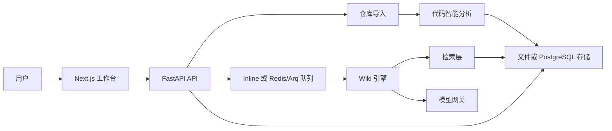

<h1 align="center">RepoMind</h1>

<p align="center">
  <a href="README.md">English</a> | <a href="README.zh-CN.md">简体中文</a>
</p>

<p align="center">
  <strong>面向代码仓库的证据工作台与带引用的 LLM Wiki 生成器。</strong>
</p>

<p align="center">
  <a href="#快速开始"></a>
  <a href="#api"></a>
  <a href="#截图"></a>
  <a href="#docker"></a>
  <a href="#模型提供方"></a>
</p>

RepoMind 可以把一个 GitHub 仓库转换成可导航、可追溯的代码证据工作台。它会克隆公开仓库、过滤噪声文件、生成仓库画像、提取符号、构建轻量 RepoKG、生成带源码引用的结构化 Wiki 页面，并基于仓库证据回答问题，同时记录 Agent 运行轨迹以便审计。

项目默认使用 `MockModelClient`，因此在没有外部模型 API Key 的情况下也可以完整运行。本地开发、截图、CI smoke test 和离线演示都建议使用 `MODEL_PROVIDER=mock`。

## 目录

- [截图](#截图)
- [功能特性](#功能特性)
- [架构](#架构)
- [快速开始](#快速开始)
- [Docker](#docker)
- [配置](#配置)
- [API](#api)
- [开发](#开发)
- [项目结构](#项目结构)
- [路线图](#路线图)
- [许可证](#许可证)

## 截图

### 仓库导入

<p align="center">
  
</p>

### Web 工作台

<p align="center">
  
</p>

### Wiki、图谱与运行轨迹

<table>
  <tr>
    <td width="50%">
      
    </td>
    <td width="50%">
      
    </td>
  </tr>
  <tr>
    <td colspan="2">
      
    </td>
  </tr>
</table>

## 功能特性

- 通过 GitHub 仓库 URL 导入公开仓库。
- 过滤 `.git`、`node_modules`、虚拟环境、构建产物、二进制文件和超大文件等噪声或风险内容。
- 检测语言、包管理器、框架、README、依赖文件、配置文件、入口文件、测试文件、重要文件和重要目录。
- 提取 Python、JavaScript、TypeScript 中的类、函数、方法、导入和导出符号。
- 构建轻量 RepoKG，包含仓库、目录、文件、配置、依赖、类、函数、方法等节点。
- 生成 Overview、Architecture、Core Modules、Important Files、How to Run、Reading Guide 等结构化 Wiki 页面。
- 校验源码引用，并在 Evidence 面板中展示对应源码。
- 基于 Wiki、符号、图谱证据和源码片段回答仓库问题。
- 记录 Wiki 生成和问答流程中的 Agent run 与 tool-call trace。
- 支持本地 JSON 元数据存储，也支持通过 SQLAlchemy 接入 PostgreSQL。
- 支持本地 inline 任务模式，也支持 Redis/Arq worker 模式。
- 默认使用内存检索，同时可通过配置接入 Qdrant 和 SQL/pgvector 风格适配器。
- 提供 Next.js 工作台，集成 Wiki、React Flow 图谱、Ask、Evidence、Monaco、Mermaid 和 shadcn 风格 UI 组件。

## 架构



RepoMind 的本地开发路径刻意保持轻量：文件存储、inline job、内存检索和 mock 模型输出就足以跑通完整流程。需要更接近生产环境时，可以切换到 PostgreSQL、Redis、Qdrant 和真实模型提供方。

## 快速开始

### Windows 一键启动

在仓库根目录运行：

```bat
start_repomind.bat
```

启动器会启动 FastAPI 和 Next.js 工作台，等待健康检查通过后打开 `http://127.0.0.1:3000/repos/new`，并保持两个服务运行，直到你在终端按下 `Ctrl+C`。

常用参数：

```bat
start_repomind.bat --no-browser
start_repomind.bat --mode dev
start_repomind.bat --smoke --no-browser
stop_repomind.bat
```

日志会写入 `tmp/repomind_api.log` 和 `tmp/repomind_web.log`。

### 手动本地启动

安装 Python 依赖：

```bash
python -m pip install -e ".[dev]"
```

安装前端依赖：

```bash
cd apps/web
npm install
cd ../..
```

启动 API：

```bash
uvicorn apps.api.main:app --reload --host 127.0.0.1 --port 8000
```

启动前端：

```bash
cd apps/web
npm run dev
```

打开：

```text
http://127.0.0.1:3000/repos/new
```

## Docker

```bash
docker compose up --build
```

服务地址：

```text
Web:      http://127.0.0.1:3000
API:      http://127.0.0.1:8000
Postgres: postgres://127.0.0.1:5432
Redis:    redis://127.0.0.1:6379
Qdrant:   http://127.0.0.1:6333
```

Docker 栈包含 Postgres、Redis、Qdrant、FastAPI 服务、worker 服务和 Next.js Web 应用。

## 配置

复制 `.env.example` 到 `.env` 以覆盖本地配置：

```bash
cp .env.example .env
```

RepoMind 会自动加载仓库根目录的 `.env`。真实 API Key 应放在 `.env` 中；该文件已被 Git 忽略。

### 核心配置

| 变量 | 默认值 | 说明 |
| --- | --- | --- |
| `REPOMIND_DATA_DIR` | `./data` | 本地仓库和元数据目录。 |
| `REPOMIND_STORAGE` | `file` | `file` 使用本地 JSON 元数据，`postgres` 使用 SQL 存储。 |
| `REPOMIND_QUEUE_MODE` | `inline` | `inline` 用于本地任务，`arq` 用于 Redis/Arq worker。 |
| `REPOMIND_VECTOR_STORE` | `memory` | 检索后端。`memory` 是默认本地模式。 |
| `NEXT_PUBLIC_API_BASE_URL` | `http://127.0.0.1:8000` | 前端使用的 API Base URL。 |
| `MODEL_PROVIDER` | `mock` | 模型提供方。API Key 缺失或过期时请使用 `mock`。 |

### 模型提供方

RepoMind 支持以下 provider：

```env
MODEL_PROVIDER=mock
MODEL_PROVIDER=openai
MODEL_PROVIDER=openai_compatible
MODEL_PROVIDER=claude
MODEL_PROVIDER=deepseek
```

`mock` 模式是确定性的，不会调用任何外部模型 API。它适合本地开发、截图、CI smoke test 和离线演示。

如需真实模型调用，请配置对应的 Key 和模型字段：

```env
OPENAI_API_KEY=
OPENAI_BASE_URL=https://api.openai.com/v1
OPENAI_MODEL=gpt-4.1-mini

ANTHROPIC_API_KEY=
ANTHROPIC_MODEL=claude-sonnet-4-5

DEEPSEEK_API_KEY=
DEEPSEEK_BASE_URL=https://api.deepseek.com/v1
DEEPSEEK_MODEL=deepseek-chat
```

### GitHub 克隆排障

如果导入时出现 GitHub HTTPS 连接错误，可以尝试优先使用 SSH：

```env
REPOMIND_GIT_CLONE_STRATEGY=ssh-first
```

如果网络需要代理：

```env
REPOMIND_GIT_PROXY=http://127.0.0.1:7890
```

如果使用 GitHub 镜像：

```env
REPOMIND_GITHUB_MIRROR=https://gh-proxy.example.com/
# 或
REPOMIND_GITHUB_MIRROR=https://mirror.example.com/{owner}/{repo}.git
```

## API

```text
GET  /health
POST /api/repos/import
GET  /api/repos/{repo_id}/profile
GET  /api/repos/{repo_id}/files
GET  /api/repos/{repo_id}/symbols
GET  /api/repos/{repo_id}/graph
GET  /api/repos/{repo_id}/source?path=...
POST /api/repos/{repo_id}/wiki/generate
GET  /api/repos/{repo_id}/wiki
GET  /api/repos/{repo_id}/wiki/{page_slug}
POST /api/repos/{repo_id}/ask
GET  /api/runs/{run_id}
GET  /api/runs/{run_id}/trace
```

导入仓库示例：

```bash
curl -X POST http://127.0.0.1:8000/api/repos/import \
  -H "Content-Type: application/json" \
  -d "{\"url\":\"https://github.com/pallets/flask\"}"
```

健康检查示例：

```bash
curl http://127.0.0.1:8000/health
```

## 开发

运行测试：

```bash
python -m pytest
```

安装可选 Tree-sitter 解析器支持：

```bash
python -m pip install -e ".[parser]"
```

没有 Tree-sitter parser 时，RepoMind 会回退到 Python AST 和轻量 JavaScript/TypeScript 解析，因此导入流程仍然可以运行。

构建并 smoke-test 生产前端：

```bash
cd apps/web
npm run build
cd ../..
python scripts/frontend_smoke.py
python scripts/browser_smoke.py
```

只有在配置了有效 provider 凭据后，才运行真实模型 smoke test：

```bash
python scripts/live_llm_smoke.py
python scripts/live_api_smoke.py
python scripts/tree_sitter_smoke.py
```

## 项目结构

```text
apps/
  api/                         FastAPI 后端
  web/                         Next.js 工作台前端
packages/
  repo_ingestion/              克隆、忽略规则、扫描、检测、仓库画像
  code_intelligence/           符号提取与 RepoKG 构建
  model_gateway/               OpenAI-compatible、OpenAI、Claude、DeepSeek、mock 客户端
  wiki_engine/                 结构化 Wiki 生成、引用、Mermaid
  retrieval/                   Wiki、符号和源码上下文打包
  harness/                     Agent runtime 与 trace 状态
  storage/                     文件与 SQLAlchemy/PostgreSQL 元数据存储
  tasks/                       Inline 与 Redis/Arq 队列适配器
scripts/                       启动、smoke test 与运行时辅助脚本
tests/                         单元测试与 API 测试
docs/assets/screenshots/       README 截图与视觉资产
```

## 路线图

- 将长时间运行的导入和 Wiki 任务完整迁移到持久化 Redis/Arq 后台执行，并采用优先轮询的 UI。
- 启用生产级 embeddings 和远程 Qdrant 写入。
- 增强 Mermaid 校验和图谱布局控制。
- 添加认证和私有仓库导入。
- 添加仓库对比和变更感知 Wiki 刷新。
- 添加一等公民的贡献指南和发布自动化。

## 贡献

欢迎提交 Issue 和 Pull Request。较大的改动建议先创建一个聚焦的 Issue，说明你希望改进的仓库工作流、API 表面或 UI 行为。

提交 PR 前推荐运行：

```bash
python -m pytest
cd apps/web
npm run build
```

## 许可证

该仓库目前还没有包含许可证文件。正式作为开源项目发布或接受外部贡献前，请先添加 `LICENSE` 文件。
